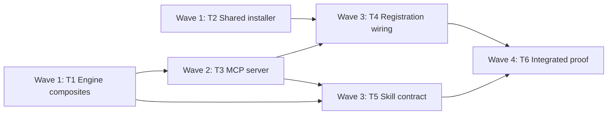

# Nerd Memory MCP Fast Path Implementation Plan

## Summary

| Item | Details |
| --- | --- |
| Outcome | Nerd Memory's hot workflows run as four MCP tools against one warm process, collapsing today's four-call recall sequence into one agent turn, with the `python3 memory.py` CLI as an exact-equivalent fallback whenever MCP is unavailable or errors. |
| Approach | Add composite operations to `MemoryStore` once, expose them through both the existing CLI parser and a new dependency-free stdio MCP server, and register the server through a shared installer extracted from the parked UFast experiment. |
| Scope | `skills/nerd-memory/` (engine, server, SKILL, one reference), `scripts/` (shared installer, `install.sh`, `validate_skills.py`), `tests/`, `README.md`. No schema change, no new dependency, no change to the seven pattern fields or the confirmation gate. |
| Proof | New `tests/test_memory_mcp.py` proves tool contracts, CLI/MCP equivalence, schema-restart handling, and namespace confinement; extended `tests/test_install_mcp.py` proves generic registration; `python3 -m unittest discover -s tests` and `python3 scripts/validate_skills.py` gate regressions. |
| Deferred | `deny`, `resolve-denial`, `propose-split`, `confirm-split`, `preview-forget`, `forget` stay CLI-only (rare and destructive). Promoting the UFast MCP server into `nerd-xfast` stays parked. |

### Measured baseline (this host, recorded 2026-08-19)

| Path | Machine time | Agent turns |
| --- | --- | --- |
| `python3 memory.py status` cold | 59ms median | 1 |
| `rtk hook claude` PreToolUse per Bash call | 15ms | — |
| Full recall sequence `--help` → `status` → `enable` → `propose` | 296ms | 4 |
| POC warm MCP `tools/call` | 0.05ms median (34–51ms one-time boot) | 1 |
| POC composite `memory_recall` | 6.7ms | 1 |

### Measured MCP process lifecycle (verified 2026-08-19)

A PID-logging stdio probe server was driven through real headless agent sessions
(`/tmp/nerd-mcp-lifecycle/probe_server.py`, config injected via
`claude --mcp-config --strict-mcp-config` and `codex exec -c mcp_servers.*`, so
no persistent agent configuration was written).

| Client | Distinct server PIDs across 3 tool calls | `process_start` events | Verdict |
| --- | --- | --- | --- |
| Claude Code | 1 (`68279`) | 1 | Warm — one process per session |
| Codex | 1 (`70036`) | 1 | Warm — one process per session |
| Cursor | Not measured | — | `cursor-agent` requires authentication on this host; probe not run. Uses the same stdio contract, so the plan assumes warm but does not claim it. |

Claude Code timeline, offsets from `process_start`:

| Offset | Event |
| --- | --- |
| 0.3ms | `initialize` |
| 7.2ms | `tools/list` |
| 7703.8ms | first `tools/call` |
| 9791.5ms | second `tools/call` |
| 11853.4ms | third `tools/call` |
| 21200.1ms | `process_exit` at session end |

Three consequences, all load-bearing:

- **Server boot is off the hot path.** `initialize` and `tools/list` complete
  7ms after spawn, at session startup, before any user request. The 34–51ms boot
  measured in the POC never appears in per-request latency. Warm 0.05ms is the
  real per-call figure.
- **The agent turn is now measured, not modeled.** Consecutive `tools/call`
  arrivals are 2062ms and 1994ms apart for a trivial no-op tool — so ~2.0s per
  agent turn on this host, replacing the earlier ~2.5s assumption. Collapsing
  four turns to one saves **~6.0s per memory-enabled request**, against 74ms
  saved by the transport change. Turn count is ~80x the transport win.
- **Codex batches independent tool calls** (all three probes arrived within
  21ms in one turn) while Claude Code issued them sequentially. This does not
  weaken the plan: the recall sequence is data-dependent — `enable` runs only if
  `status` reports disabled, and `propose` runs after — so no client can batch
  it. Turn collapse must be done in the tool, which is what T1 and T3 do.

The plan optimizes turns first and transport second.

## Constraints and Non-goals

| Type | Constraint |
| --- | --- |
| Preserve | Every existing `memory.py` subcommand, its flags, its single-JSON-on-stdout success shape, and its structured-JSON-on-stderr failure shape with exit codes 1–6 from `_ERROR_CODES` (`memory.py:4453`). |
| Preserve | The confirmation gate. Composites may fuse `consent_status`+`enable`+`propose` and `confirm`+`consume`, because `SKILL.md` already authorizes auto-`enable` from the invocation event and requires `confirm` before `consume`. A composite must never fuse `propose` with `confirm`. |
| Preserve | `SCHEMA_VERSION = 9` and the stale-writer guard `_require_current_schema` (`memory.py:947`). No migration in this plan. |
| Safety | The MCP server holds a long-lived `MemoryStore`. `SKILL.md:135` forbids retrying through a stale handle, so the server must close the handle and refuse to retry on schema change. |
| Safety | The server never shells out, never accepts a `--db` outside the runtime default unless the caller passes one explicitly for tests, and never reads a namespace other than the one supplied per call. |
| Safety | Registration must be idempotent and must refuse to overwrite a conflicting non-Nerd server named `nerd-memory-tools`. |
| Exclude | No daemon left running by the installer, no remote server, no authentication, no new runtime dependency (Python 3.12 stdlib only). |
| Exclude | No change to `benchmarks/`. The latency figures above are directional POC evidence and must not be published to `README.md` as production benchmarks. |

## Task Dependency Graph (TDG)

| Task | Wave | Depends on | Produces |
| --- | --- | --- | --- |
| T1 | 1 | None | `MemoryStore` composite operations + matching CLI subcommands |
| T2 | 1 | None | Generic `scripts/install_mcp.py` (server-agnostic) |
| T3 | 2 | T1 | `skills/nerd-memory/scripts/mcp_server.py` |
| T4 | 3 | T2, T3 | Registration wiring in `install.sh` and `validate_skills.py` |
| T5 | 3 | T1, T3 | MCP-first / CLI-fallback contract in SKILL and reference |
| T6 | 4 | T4, T5 | Integrated proof and README update |



Critical path is T1 → T3 → T4 → T6. T1 and T2 touch disjoint files and may run
in parallel; if delegated, T1 owns `skills/nerd-memory/scripts/memory.py` and T2
owns `scripts/install_mcp.py` exclusively, and T6 is the single integration owner.

## Ordered Work

### Task 1: Composite operations in the engine

**Focus:** One `MemoryStore` method per fused workflow, reachable identically from CLI and, later, MCP.

**Files:**

| Action | Path |
| --- | --- |
| Modify | `skills/nerd-memory/scripts/memory.py` (add methods near `consent_status` at `:1193`; add subparsers in `_build_parser` at `:4159`; add dispatch in `_run_command` near `:4361`) |
| Test | `tests/test_memory_engine.py` |

**Interfaces:**

| Direction | Contract |
| --- | --- |
| Consumes | Existing `MemoryStore.consent_status`, `.enable`, `.propose`, `.confirm`, `.consume`, `.observe`, `.consolidate`. |
| Produces | `MemoryStore.recall(*, namespace, episode_id, input_text, context, baseline, consent_ref, baseline_source=None, baseline_ref=None) -> dict` returning `{"consent": {"was_enabled": bool}, "proposal": <propose result>}`. |
| Produces | `MemoryStore.settle(proposal_id, phrase, *, source, confirmation_ref) -> dict` returning `{"confirmation": <confirm result>, "consumption": <consume result>}`, calling `consume` with the `grant_token` returned by `confirm`. |
| Produces | `MemoryStore.learn(*, namespace, episode_id, pattern_type, pattern_key, value, scope, triggers, operation, evidence_ref, ...) -> dict` returning `{"observation": <observe result>, "consolidation": <consolidate result>}`. |
| Produces | CLI subcommands `recall`, `settle`, `learn` with flags matching the fused subcommands' existing flags, minus flags the composite supplies itself. |

- [ ] **Step 1: Write the failing tests**

Add to `tests/test_memory_engine.py`:

```python
def test_recall_enables_then_proposes(self):
    store = MemoryStore(":memory:")
    result = store.recall(
        namespace="ns-a", episode_id="ep-1", input_text="plan the work",
        context={}, baseline=BLIND_BASELINE, consent_ref="evt-1",
    )
    self.assertFalse(result["consent"]["was_enabled"])
    self.assertTrue(store.consent_status("ns-a")["enabled"])
    self.assertIn("proposal_id", result["proposal"])

def test_recall_is_idempotent_on_consent(self):
    store = MemoryStore(":memory:")
    store.enable("ns-a", consent_ref="evt-1")
    result = store.recall(..., consent_ref="evt-2")
    self.assertTrue(result["consent"]["was_enabled"])

def test_settle_confirms_then_consumes_with_returned_grant(self):
    # settle must reject a wrong phrase before any consume attempt
    with self.assertRaises(MemoryConsentError):
        store.settle(proposal_id, "wrong phrase", source="direct_user",
                     confirmation_ref="evt-3")
    self.assertEqual(store.get_proposal(proposal_id)["status"],
                     "pending_confirmation")

def test_composites_never_fuse_propose_with_confirm(self):
    self.assertNotIn("confirm", inspect.getsource(MemoryStore.recall))
```

- [ ] **Step 2: Run and confirm failure**

Run: `python3 -m unittest tests.test_memory_engine -v`

Expected: FAIL with `AttributeError: 'MemoryStore' object has no attribute 'recall'`.

- [ ] **Step 3: Implement**

- Add the three methods. Each is a thin sequencer over existing methods; put no new validation, normalization, or policy in them.
- On any exception inside a composite, let it propagate unchanged so `_ERROR_CODES` maps it to the same exit code the single-step CLI would produce.
- Register `recall`, `settle`, `learn` subparsers reusing the same `add_argument` definitions as their component subcommands, and route them in `_run_command`.

- [ ] **Step 4: Prove**

Run: `python3 -m unittest tests.test_memory_engine tests.test_memory_security tests.test_memory_denial -v`

Expected: PASS, including the untouched single-step tests.

### Task 2: Generic shared MCP installer

**Focus:** One installer that registers any Nerd stdio MCP server for Claude Code, Codex, and Cursor.

**Files:**

| Action | Path |
| --- | --- |
| Create | `scripts/install_mcp.py` |
| Test | `tests/test_install_mcp.py` |

**Interfaces:**

| Direction | Contract |
| --- | --- |
| Consumes | `docs/experiments/nerd-ufast/install_mcp.py` as the implementation source (311 lines: `_copy_runtime`, `_health_check`, `_existing_registration`, `_remove_registration`, `_add_registration`, `install`). |
| Produces | `install_server(agents, *, server_name, runtime_directory, source_directory, runtime_files, expected_tools, home=None, environment=None) -> Path`. |
| Produces | Registration state at `<home>/.nerd/mcp/registrations.json`, keyed `{server_name: {agent: {"server": path}}}` — a nesting change from the experiment's `{"agents": {...}}`, so one file can hold several servers. |

- [ ] **Step 1: Write the failing test**

Extend `tests/test_install_mcp.py` to import `scripts/install_mcp.py` and assert:

```python
def test_registers_two_servers_without_collision(self):
    install_server(("codex",), server_name="nerd-a", ...)
    install_server(("codex",), server_name="nerd-b", ...)
    state = json.loads((home / ".nerd/mcp/registrations.json").read_text())
    self.assertEqual(set(state), {"nerd-a", "nerd-b"})

def test_conflicting_foreign_registration_raises(self): ...
def test_reinstall_is_idempotent(self): ...
def test_health_check_rejects_unexpected_tool_set(self): ...
```

- [ ] **Step 2: Run and confirm failure**

Run: `python3 -m unittest tests.test_install_mcp -v`

Expected: FAIL with `ModuleNotFoundError` / missing `install_server`.

- [ ] **Step 3: Implement**

- Copy the experiment installer to `scripts/install_mcp.py` and parameterize the four module constants (`SERVER_NAME`, `RUNTIME_DIRECTORY`, `RUNTIME_FILES`, and the `_source_directory()` result) as arguments.
- Replace the hardcoded `{"inspect", "apply_verify"}` assertion in `_health_check` with the `expected_tools` argument.
- Change the state shape to nest by `server_name`; treat a legacy top-level `"agents"` key as UFast-owned and leave it untouched.
- Leave `docs/experiments/nerd-ufast/install_mcp.py` and its existing tests unmodified.

- [ ] **Step 4: Prove**

Run: `python3 -m unittest tests.test_install_mcp -v`

Expected: PASS, with the pre-existing UFast installer tests still passing.

### Task 3: Nerd Memory MCP server

**Focus:** A dependency-free stdio server exposing exactly four tools over one warm `MemoryStore`.

**Files:**

| Action | Path |
| --- | --- |
| Create | `skills/nerd-memory/scripts/mcp_server.py` |
| Test | `tests/test_memory_mcp.py` |

**Interfaces:**

| Direction | Contract |
| --- | --- |
| Consumes | `MemoryStore.recall`, `.settle`, `.learn` (T1) and `.consent_status` (`memory.py:1193`), `.list_patterns` (`memory.py:4379`). |
| Produces | Server identity `nerd-memory-tools`, protocol `2025-06-18`, tools `memory_recall`, `memory_settle`, `memory_learn`, `memory_inspect`. |
| Produces | Each `tools/call` result carries `content[0].text` (canonical JSON), `structuredContent`, and `isError`. |

Model the JSON-RPC loop, `_response`/`_error` helpers, and `main()` on
`docs/experiments/nerd-ufast/skill/scripts/mcp_server.py`. Annotate
`memory_inspect` `readOnlyHint: true`; annotate the other three
`readOnlyHint: false, destructiveHint: false`.

- [ ] **Step 1: Write the failing tests**

Create `tests/test_memory_mcp.py`:

```python
SERVER = ROOT / "skills" / "nerd-memory" / "scripts" / "mcp_server.py"

def test_initialize_and_tools_list(self):
    responses = self.drive([INITIALIZE, TOOLS_LIST])
    self.assertEqual(responses[0]["result"]["serverInfo"]["name"], "nerd-memory-tools")
    self.assertEqual({t["name"] for t in responses[1]["result"]["tools"]},
                     {"memory_recall", "memory_settle", "memory_learn", "memory_inspect"})

def test_recall_matches_cli_recall_byte_for_byte(self):
    # same --db, same arguments; compare after removing generated ids/timestamps
    self.assertEqual(normalize(mcp_result), normalize(cli_result))

def test_schema_change_reports_restart_required_and_does_not_retry(self):
    # bump metadata.schema_version behind the running server
    result = self.call("memory_inspect", {"namespace": "ns-a"})
    self.assertTrue(result["isError"])
    self.assertEqual(result["structuredContent"]["error"]["code"], "restart_required")

def test_malformed_line_does_not_corrupt_the_stream(self): ...
def test_unknown_tool_is_an_error_result_not_a_crash(self): ...
def test_call_reads_only_the_supplied_namespace(self): ...
```

- [ ] **Step 2: Run and confirm failure**

Run: `python3 -m unittest tests.test_memory_mcp -v`

Expected: FAIL — `mcp_server.py` does not exist.

- [ ] **Step 3: Implement**

- Resolve the store path from `argv[1]` when present, otherwise `memory.default_store_path()` (`memory.py:4166`).
- Open the `MemoryStore` lazily on first tool call and reuse it.
- Wrap every tool call: catch `MemoryEngineError` and map it through the same `_ERROR_CODES` table so `structuredContent.error.code` equals the CLI's error code string.
- Handle the schema guard specifically. `_require_current_schema` (`memory.py:947`) raises `MemoryInvariantError("memory runtime schema version changed; restart this runtime")`. On that exact message: `close()` the store, set a sticky `restart_required` flag, and return `{"error": {"code": "restart_required", ...}}` for that call and every later call. Never reopen and never retry the operation.
- On any other exception, close and drop the handle so the next call opens a fresh one, then return the mapped error result.

- [ ] **Step 4: Prove**

Run: `python3 -m unittest tests.test_memory_mcp -v`

Expected: PASS.

### Task 4: Registration wiring

**Focus:** `./scripts/install.sh` registers the memory server, and validation enforces the new script.

**Files:**

| Action | Path |
| --- | --- |
| Modify | `scripts/install.sh:52` (after the `install_hooks.py` call) |
| Modify | `scripts/validate_skills.py:203` (`REQUIRED_SCRIPTS["nerd-memory"]`) |
| Test | `tests/test_install.py` |

- [ ] **Step 1: Baseline check**

Run: `python3 scripts/validate_skills.py`

Expected: Exit 0 before the change, establishing the pre-change baseline.

- [ ] **Step 2: Implement**

- Set `REQUIRED_SCRIPTS["nerd-memory"] = ("memory.py", "mcp_server.py")`.
- Append to `install.sh` a call registering `nerd-memory-tools` from `scripts/install_mcp.py`, passing the same agent list already in `"$@"`.
- Make MCP registration non-fatal: if it fails, print a warning naming the CLI fallback and exit 0, so a missing agent CLI cannot break skill installation.

- [ ] **Step 3: Prove**

Run: `python3 -m unittest tests.test_install tests.test_install_mcp -v && python3 scripts/validate_skills.py`

Expected: PASS and exit 0. Add one `tests/test_install.py` case asserting that a failing MCP registration leaves `install.sh` exit status at 0.

### Task 5: MCP-first, CLI-fallback contract

**Focus:** The skill tells the agent to try MCP once, then fall back to the CLI, with no behavior difference either way.

**Files:**

| Action | Path |
| --- | --- |
| Modify | `skills/nerd-memory/SKILL.md:105` (`## Select One Workflow`) |
| Modify | `skills/nerd-memory/references/recall-and-apply.md:106` |
| Test | `tests/test_skill_contracts.py` |

- [ ] **Step 1: Write the failing test**

Add to `tests/test_skill_contracts.py` assertions that `SKILL.md` names `nerd-memory-tools`, states the fallback trigger, and still requires `confirm` before `consume`; and that `recall-and-apply.md` documents both surfaces.

- [ ] **Step 2: Run and confirm failure**

Run: `python3 -m unittest tests.test_skill_contracts -v`

Expected: FAIL on the missing contract strings.

- [ ] **Step 3: Implement**

Replace the `## Select One Workflow` runtime sentence with a two-surface rule:

| Surface | Use when | Rule |
| --- | --- | --- |
| MCP `nerd-memory-tools` | Default | Call `memory_recall`, `memory_settle`, `memory_learn`, or `memory_inspect`. |
| CLI `python3 <skill-root>/scripts/memory.py` | MCP fallback, or any operation outside the four tools | Same subcommand names and arguments. |

- Fall back exactly once, on: the tool is absent from the registry; the transport fails; or the result carries `error.code` of `restart_required`. Never fall back on a domain error (`invalid_input`, `consent_required`, `invariant_violation`, `not_found`), because the CLI would return the identical error.
- State that both surfaces run the same engine, so a fallback changes latency only, never the decision, the gate, or the receipt.
- Remove the `memory.py --help` instruction from `recall-and-apply.md:106`; the MCP schemas carry the arguments and the composite subcommands are documented in the table above. This removes the discovery turn from the hot path.

- [ ] **Step 4: Prove**

Run: `python3 -m unittest tests.test_skill_contracts tests.test_skill_structure -v && python3 scripts/validate_skills.py`

Expected: PASS and exit 0.

### Task 6: Integrated proof

**Focus:** One end-to-end run over the registered server, and honest documentation.

**Files:**

| Action | Path |
| --- | --- |
| Modify | `README.md:41` |
| Test | `tests/test_readme.py` |

- [ ] **Step 1: End-to-end check**

Run `install_server` against a temporary `NERD_INSTALL_HOME`, then drive
`initialize` → `tools/list` → `memory_recall` → `memory_settle` against the
installed copy using a temporary `--db`.

Expected: four tools listed; `memory_recall` returns a `proposal_id`;
`memory_settle` with the wrong phrase returns `consent_required` and leaves the
proposal `pending_confirmation`.

- [ ] **Step 2: Re-measure**

Re-run the T1-vs-T3 comparison against the production server and record turns
and machine time. Do not reuse the POC numbers in this plan as production
results. Lifecycle is already settled for Claude Code and Codex; if an
authenticated Cursor is available, rerun the PID probe there to close the last
unknown.

- [ ] **Step 3: Update README**

- Amend `README.md:41` to say Memory exposes `nerd-memory-tools` when registered and falls back to the CLI otherwise.
- Do not add a benchmark row. `README.md:137` already carries the standing caveat that experimental MCP latency is directional only.

- [ ] **Step 4: Full proof**

Run: `python3 -m compileall -q scripts benchmarks tests skills && python3 -m unittest discover -s tests && python3 scripts/validate_skills.py && npx skills add . --list`

Expected: all PASS, exit 0, and 17 skills discovered (`EXPECTED_SKILL_COUNT` in the workflow).

## Self Review

| Checkpoint | Nerd Review lens | Evidence question | Status |
| --- | --- | --- | --- |
| Executability | Level 1 — concrete defects | Are paths, symbols, signatures, commands, and expected results exact? | Pass — every cited line (`memory.py:947`, `:1193`, `:4159`, `:4361`, `:4453`; `validate_skills.py:203`; `install.sh:52`; `SKILL.md:135`) was read, and the POC in `/tmp/nerd-mem-poc/` executed `recall` end-to-end against the real `MemoryStore`. |
| Repository fit | Level 2 — consistency and proof | Does each task follow repository rules with matching proof? | Pass — unittest discovery, `validate_skills.py`, and `npx skills add . --list` match `.github/workflows`; the server and installer follow the in-repo UFast pattern rather than a new one. |
| Architecture | Level 3 — harmful complexity | Any avoidable coupling, duplicated behavior, or speculative abstraction? | Pass — composites live once in the engine, so CLI and MCP cannot diverge; T2 extracts the installer instead of copying it. The four-tool surface is bounded by measured need, not by mirroring twenty subcommands. |
| Scope integrity | Adversarial evidence check | Is every task required, and is every criterion owned once? | Finding resolved — an earlier draft published POC latency to README; T6 Step 3 now forbids it. |

- **Findings:**
  - **Medium — unshipped precedent.** The UFast MCP integration plan (`docs/plans/2026-08-04-nerd-ufast-mcp-integration.md`) targeted `skills/nerd-ufast/scripts/`, but `skills/nerd-xfast/` has no `scripts/` directory: that work never shipped. `docs/feedbacks/ufast-1.md` was checked and records no cause, so the reason is unrecorded. The registration machinery itself is proven — `tests/test_install_mcp.py` passes today against the experiment installer — so the risk is prioritization, not a technical blocker. Mitigation is already in the plan: T4 makes registration non-fatal and T5 keeps the CLI a first-class surface, so this work delivers value even if registration is never adopted.
  - **Resolved — turn cost is now measured.** The earlier ~2.5s-per-turn assumption was replaced by a measured ~2.0s from the lifecycle probe above. Both the turn count (4 → 1) and the per-turn cost are now observed values.
- **Unknowns:**
  - Cursor's MCP process lifecycle is unverified because `cursor-agent` is not authenticated on this host. Claude Code and Codex are confirmed warm. If Cursor turns out to restart per call it pays 34–51ms boot per call instead of 0.05ms, which is still under the 74ms CLI path, and the turn collapse is unaffected. Confirm opportunistically in T6 Step 2; not a blocker.

## Final Validation

| Check | Command | Expected |
| --- | --- | --- |
| Focused behavior | `python3 -m unittest tests.test_memory_mcp tests.test_memory_engine tests.test_install_mcp -v` | PASS |
| Regression | `python3 -m unittest discover -s tests` | PASS |
| Skill validation | `python3 scripts/validate_skills.py` | Exit 0 |
| Syntax | `python3 -m compileall -q scripts benchmarks tests skills` | Exit 0 |
| Discovery | `npx skills add . --list` | 17 skills |
| Diff hygiene | `git diff --check` | No output |

- T6 Step 1 needs a writable `NERD_INSTALL_HOME` and at least one of the `claude`, `codex`, or `cursor` CLIs on `PATH`; skip the agents whose CLI is absent rather than failing the run.

## Acceptance Criteria

| ID | Criterion | Evidence |
| --- | --- | --- |
| AC1 | A memory-enabled request completes consent, retrieval, and proposal in one agent turn. | T6 Step 1 drives one `memory_recall` call that returns a `proposal_id` from a namespace that was not previously enabled. |
| AC2 | MCP and CLI produce identical decisions. | `test_recall_matches_cli_recall_byte_for_byte` in T3. |
| AC3 | Fallback is automatic and bounded. | T5 contract test plus the fallback-trigger list; a domain error must not trigger fallback. |
| AC4 | The confirmation gate is intact. | `test_composites_never_fuse_propose_with_confirm` (T1) and the wrong-phrase assertion in T6 Step 1. |
| AC5 | A schema-version change is fail-closed. | `test_schema_change_reports_restart_required_and_does_not_retry` (T3). |
| AC6 | Installation stays idempotent and non-destructive. | Reinstall and foreign-conflict tests in T2; non-fatal registration test in T4. |
