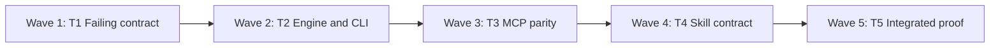

# Nerd Memory Explicit Global Fallback Implementation Plan

## Focus Record

| Item | Details |
| --- | --- |
| Intention | Allow Nerd Memory to search all namespaces for context only when the current namespace has no applicable pattern and the user explicitly requested a global search. |
| Expectation | Plan |
| Scope | Plan changes to `skills/nerd-memory`, its deterministic runtime, MCP/CLI contracts, documentation, and tests. Create this plan only; do not implement the behavior. |

## Summary

| Item | Details |
| --- | --- |
| Outcome | Recall remains namespace-scoped by default. When the current direct-user event explicitly requests global search, a scoped miss triggers one second retrieval pass where the internal search filter uses `namespace=None` to search every enabled namespace. |
| Approach | Preserve the existing non-null proposal namespace because it owns consent, episode supersession, and confirmation. Add a hash-bound direct-user global-search attestation to `propose`/`recall`; factor pattern selection into one helper whose nullable namespace changes only the SQL search filter; retain the existing proposal and confirmation gates for any cross-namespace match. |
| Scope | `skills/nerd-memory/scripts/memory.py`, `skills/nerd-memory/scripts/mcp_server.py`, `skills/nerd-memory/SKILL.md`, `skills/nerd-memory/references/{memory-contract.md,recall-and-apply.md}`, and focused tests in `tests/{test_memory_engine.py,test_memory_mcp.py,test_memory_security.py,test_skill_contracts.py}`. |
| Proof | Red/green engine, CLI, MCP, migration, isolation, invalidation, and skill-contract tests; then the full unittest suite, skill validator, and diff hygiene. |
| Deferred | No semantic/embedding search, namespace ranking, user-prefix tenant hierarchy, new MCP tool, dependency, remote store, automatic suggestion to search globally, or global fallback for inspect/list/write operations. |

## Constraints and Non-goals

| Type | Constraint |
| --- | --- |
| Preserve | `namespace: str` remains required for the proposal, consent record, episode, denial/split lifecycle, and confirmation replay boundary. Only the internal pattern-query filter accepts `str | None`; `None` means no namespace predicate. |
| Preserve | A current-namespace context match wins even when global fallback was explicitly requested. The global pass runs only when the scoped pass has zero `confirmed` patterns after scope and trigger filtering. |
| Preserve | Current explicit endpoint fields remain authoritative; global patterns use the existing scope/trigger/rank/conflict logic and cannot bypass proposal confirmation or ordinary action authorization. |
| Safety | Global search is opt-in per current authenticated direct-user event. Missing, partial, non-user, inferred, hook-only, or remembered authorization cannot enable it. |
| Safety | Search all enabled namespaces in the same local store only. Disabled or unconfigured source namespaces are ineligible, and their consent revision must remain valid through confirmation and consumption. |
| Interaction | Never ask, offer, recommend, or suggest that the user enable global search. Without an explicit request, retain the scoped `memory_free`/`abstain` path. |
| Compatibility | Existing callers that omit the new attestation fields retain byte-for-byte retrieval semantics and the existing required string `namespace` in CLI and MCP schemas. |
| Repository baseline | Preserve the transport-preflight contract now committed at branch `HEAD` (`657521a`) in `SKILL.md`, `memory-contract.md`, `recall-and-apply.md`, `transport-preflight.md`, and `tests/test_skill_contracts.py`; compare against that baseline and reconcile rather than overwrite it. |
| Exclude | Do not change `memory_inspect`, observation/consolidation/promotion writes, transport preflight behavior, or the four-tool MCP inventory. |

## Task Dependency Graph (TDG)

| Task | Wave | Depends on | Produces |
| --- | --- | --- | --- |
| T1 | 1 | None | Executable failing contract for explicit scoped-first global fallback |
| T2 | 2 | T1 | Engine, persistence, CLI, and cross-namespace consent enforcement |
| T3 | 3 | T2 | MCP argument and result parity |
| T4 | 4 | T3 | Skill/operator/runtime documentation aligned with the runtime |
| T5 | 5 | T4 | Integrated regression proof and delivery handoff |



Keep execution sequential: T1 establishes one cross-surface contract, T2–T4 share test fixtures and overlap the newly committed transport documentation, and parallel worktrees would add conflict risk without a useful latency gain.

## Ordered Work

### Task 1: Lock the fallback and safety contract with failing tests

**Focus:** Define the exact scoped-first, explicit-only behavior before changing runtime code.

**Files:**

| Action | Path |
| --- | --- |
| Modify | `tests/test_memory_engine.py` |
| Modify | `tests/test_memory_security.py` |
| Modify | `tests/test_memory_mcp.py` |
| Modify | `tests/test_skill_contracts.py` |

**Interfaces:**

| Direction | Contract |
| --- | --- |
| Produces | `MemoryStore.propose` and `.recall` test calls with paired `global_search_source="direct_user"` and `global_search_ref=<authenticated event ref>`. |
| Produces | A search-selection contract in which internal `namespace="current"` is attempted first and `namespace=None` is attempted only after a scoped context miss. |
| Produces | MCP/CLI compatibility assertions showing omitted global fields retain current behavior. |

- [ ] **Step 1: Record the committed transport baseline and run the existing focused suites**

Run:

```bash
rtk git show --stat --oneline 657521a
rtk git diff 657521a -- skills/nerd-memory/SKILL.md skills/nerd-memory/references/memory-contract.md skills/nerd-memory/references/recall-and-apply.md skills/nerd-memory/references/transport-preflight.md tests/test_skill_contracts.py
rtk python3 -m unittest tests.test_memory_engine tests.test_memory_mcp tests.test_memory_security tests.test_skill_contracts -v
```

Expected: the transport baseline is identifiable and unreverted; existing tests pass, or any unrelated baseline failures are recorded before new assertions are added.

- [ ] **Step 2: Add red tests for retrieval behavior**

Add deterministic temporary-store fixtures covering:

- no local match + omitted attestation returns `memory_free` and never binds another namespace;
- no local match + valid direct-user attestation retrieves a matching confirmed pattern from an enabled source namespace;
- a local context match prevents the global pass, even if a globally stored pattern is more specific or has a different effect;
- a local row that fails scope or trigger checks counts as a miss and permits the explicitly authorized global pass;
- multiple equally ranked global matches preserve existing same-effect selection and `memory_conflict` behavior;
- current explicit baseline fields still win over local and global patterns;
- disabled/unconfigured namespaces are excluded from the global pass;
- missing one attestation field, a source other than `direct_user`, or a reused trusted event reference fails closed;
- the proposal output and bindings expose whether global search was requested and each selected pattern's source namespace/consent revision;
- changing or disabling a source namespace after proposal creation invalidates confirmation/consumption.

- [ ] **Step 3: Add red migration and surface tests**

- Add a v10 migration test beside `MemorySecurityTests.test_v9_migration_adds_baseline_audit_columns_and_invalidates_old_proposals`; it must prove new global-search audit columns are added atomically, the schema version becomes `10`, and live old proposals are invalidated.
- Extend `CompositeCommandLineTests` with paired `--global-search-source direct_user --global-search-ref REF` coverage and an omitted-flags compatibility case.
- Extend MCP schema/dispatch tests to require paired optional global-search fields without adding a fifth tool.
- Extend `MemoryContractTests` to require the explicit-only/scoped-first/no-prompt language and remove the old unconditional `Never search another namespace` assertion.

- [ ] **Step 4: Confirm red for the intended missing behavior**

Run:

```bash
rtk python3 -m unittest tests.test_memory_engine.CompositeOperationTests tests.test_memory_engine.CompositeCommandLineTests tests.test_memory_mcp.MemoryMcpServerTests tests.test_memory_mcp.MemoryMcpArgumentContractTests tests.test_memory_security.MemorySecurityTests tests.test_skill_contracts.MemoryContractTests -v
```

Expected: FAIL only because `propose`, `recall`, CLI, MCP, persistence, and skill text do not yet support explicit global fallback; unrelated baseline failures remain separately identified.

### Task 2: Implement the engine, persistence, and CLI boundary

**Focus:** Add one audited global fallback path without making the proposal namespace nullable or weakening lifecycle gates.

**Files:**

| Action | Path |
| --- | --- |
| Modify | `skills/nerd-memory/scripts/memory.py:76` (`SCHEMA_VERSION`) |
| Modify | `skills/nerd-memory/scripts/memory.py:573` (`MemoryStore._initialise_schema`) |
| Modify | `skills/nerd-memory/scripts/memory.py:1027` (namespace/proposal invalidation helpers) |
| Modify | `skills/nerd-memory/scripts/memory.py:1229` (`MemoryStore.recall`) |
| Modify | `skills/nerd-memory/scripts/memory.py:2298` (`MemoryStore.propose` and pattern selection) |
| Modify | `skills/nerd-memory/scripts/memory.py:2630` (proposal hash/dict/integrity) |
| Modify | `skills/nerd-memory/scripts/memory.py:4278` (CLI parser and dispatch) |
| Test | `tests/test_memory_engine.py` |
| Test | `tests/test_memory_security.py` |

**Interfaces:**

| Direction | Contract |
| --- | --- |
| Consumes | Existing required proposal `namespace: str`, `context`, `input_text`, and current consent. |
| Consumes | Optional paired `global_search_source: str | None = None` and `global_search_ref: str | None = None`; the only accepted source is `direct_user`. |
| Produces | One internal selector accepting `namespace: str | None`; a string adds `patterns.namespace = ?`, while `None` searches confirmed patterns joined to enabled source consents. |
| Produces | Persisted/hash-bound `global_search_attestation` with the stable effect `retrieval scope only; does not confirm memory or authorize action`. |
| Produces | Pattern bindings containing `source_namespace` and `source_consent_revision`, validated again before confirmation/consumption. |
| Produces | CLI flags `--global-search-source direct_user --global-search-ref TRUSTED_EVENT_REF` on `propose` and `recall`; omission preserves scoped-only behavior. |

- [ ] **Step 1: Add the v10 persisted audit shape**

- Increment `SCHEMA_VERSION` from `9` to `10`.
- Add nullable `global_search_source` and `global_search_ref` proposal columns, include guarded `ALTER TABLE` migration for older stores, and use the existing exclusive migration transaction, proposal invalidation, and stale-writer fences.
- Add a constant for the global-search attestation effect and normalize/hash it in the same style as `_baseline_attestation_payload`.
- Reject partial attestation pairs, non-`direct_user` sources, invalid refs, and sensitive values. Claim each distinct trusted event reference once in the proposal transaction; when the same direct-user event legitimately attests both the baseline and global request for that one proposal transition, bind both payloads and tombstone the ref once.

- [ ] **Step 2: Extract and apply two-pass selection**

- Extract the current confirmed-row loading plus scope/trigger filtering from `propose` into a side-effect-free helper parameterized by `namespace: str | None`.
- First call the helper with the proposal namespace. Treat zero rows after status, exact-scope, and literal-trigger filtering as the only fallback condition.
- If and only if that result is empty and a valid global-search attestation exists, call it again with `namespace=None`.
- For `None`, omit the pattern namespace predicate but join `consents` and require `enabled = 1`. Keep the current pattern type grouping, specificity/trigger ranking, deterministic tie handling, and conflict construction unchanged.
- Do not perform the global query merely because an explicit baseline prevents a matching local pattern from changing a field; a valid local context match ends retrieval.

- [ ] **Step 3: Bind cross-namespace provenance and revocation**

- Add source namespace and its current consent revision to every applied/conflict binding and therefore to the proposal hash and visible conflict provenance.
- Extend `_validate_proposal_integrity` to require every bound source namespace to remain enabled at the same revision, in addition to the current pattern status/revision/material/evidence checks.
- Extend namespace enable/disable and routing-state invalidation so proposals referencing that namespace through `proposal_patterns` become invalidated, even when their proposal namespace differs.
- Keep proposal supersession, confirmation events, denial/split ownership, and `consume` anchored to the original non-null proposal namespace.

- [ ] **Step 4: Wire composite and CLI compatibility**

- Thread the paired optional fields through `MemoryStore.recall` to `propose` without auto-confirming or consuming.
- Add the paired CLI flags to `propose` and `recall`; use the same engine validation and error codes as library/MCP callers.
- Extend proposal serialization and hash reconstruction so requested-but-empty global searches are auditable and tampering with the attestation fails integrity checks.

- [ ] **Step 5: Run engine and security proof**

Run:

```bash
rtk python3 -m unittest tests.test_memory_engine tests.test_memory_security tests.test_memory_denial -v
```

Expected: PASS, including v10 migration, scoped-first retrieval, explicit-only global retrieval, source-consent revocation, replay defense, existing namespace/scope isolation, and unchanged denial/confirmation behavior.

### Task 3: Extend the existing MCP recall contract

**Focus:** Make MCP expose the same optional audited fallback as engine/CLI without adding a new capability surface.

**Files:**

| Action | Path |
| --- | --- |
| Modify | `skills/nerd-memory/scripts/mcp_server.py:35` (`memory_recall` input schema/description) |
| Modify | `skills/nerd-memory/scripts/mcp_server.py:216` (`Server._dispatch`) only if explicit argument normalization is needed |
| Test | `tests/test_memory_mcp.py` |

**Interfaces:**

| Direction | Contract |
| --- | --- |
| Consumes | Existing required string `namespace` plus optional `global_search_source="direct_user"` and `global_search_ref`. |
| Produces | The unchanged four-tool set: `memory_recall`, `memory_settle`, `memory_learn`, `memory_inspect`. |
| Produces | MCP `memory_recall` output identical to direct `MemoryStore.recall`/CLI output after normalizing generated IDs and timestamps. |

- [ ] **Step 1: Update the JSON schema and description**

- Add the two optional properties to `memory_recall`; keep `namespace` required and typed as a string.
- State in the tool description that the server searches the supplied namespace first and accepts the pair only when the current user explicitly requested fallback across all enabled namespaces.
- Keep `additionalProperties: false`; let engine validation reject incomplete pairs so CLI and MCP return the same `invalid_input`/invariant semantics.

- [ ] **Step 2: Prove transport parity and compatibility**

Run:

```bash
rtk python3 -m unittest tests.test_memory_mcp tests.test_memory_engine.CompositeCommandLineTests -v
```

Expected: PASS; omitted fields preserve current namespace isolation, explicit fields permit only scoped-miss fallback, MCP and CLI agree, unknown fields remain rejected, and the tool inventory is still exactly four.

### Task 4: Align the skill and runtime documentation

**Focus:** Teach hosts the explicit-only fallback while forbidding prompting and preserving the committed transport-preflight contract.

**Files:**

| Action | Path |
| --- | --- |
| Modify | `skills/nerd-memory/SKILL.md:21` (activation/read authority) and `:113` (namespace rules) |
| Modify | `skills/nerd-memory/references/recall-and-apply.md:7` (consent/isolation), `:62` (proposal construction), and `:101` (MCP/CLI arguments) |
| Modify | `skills/nerd-memory/references/memory-contract.md:35` (storage/consent), `:300` (retrieval), `:314` (proposal contract), `:589` (CLI), and `:627` (required evaluation) |
| Modify | `tests/test_skill_contracts.py:1501` (`MemoryContractTests`) |

**Interfaces:**

| Direction | Contract |
| --- | --- |
| Produces | Operator rule: current namespace first; all enabled namespaces only after an explicit current direct-user request and scoped miss. |
| Produces | Silence rule: never ask, offer, recommend, or suggest global search; absent explicit request, accept the scoped no-match result. |
| Produces | Runtime contract for nullable internal search namespace, global attestation, source consent binding, migration, CLI/MCP fields, and evaluation. |

- [ ] **Step 1: Update activation and operator guidance**

- Replace the unconditional `Never search another namespace` rule with the scoped-first default and its one explicit exception.
- Clarify that ordinary skill invocation, Smart auto-enable, and hooks authorize only the current namespace; a global pass additionally requires the current user to ask for it explicitly.
- In `recall-and-apply.md`, tell the caller to omit global fields unless that exact request exists. Explicitly forbid eliciting, suggesting, or offering the option when scoped recall is empty.
- Preserve all current transport-preflight wording and behavior; this task does not alter MCP discovery, recovery prompts, or CLI fallback selection.

- [ ] **Step 2: Update the deterministic contract**

- Document why proposal `namespace` stays non-null while the internal search filter uses `None` for any enabled namespace.
- Define scoped-miss timing, source-namespace consent/revision binding, conflict behavior, proposal attestation/hash shape, migration to v10, exact CLI flags, and MCP parity.
- Replace evaluation statements that require unconditional exact-namespace isolation with tests that prove default isolation plus the explicit, scoped-first exception.
- Keep the existing research basis: its namespace, provenance, abstention, and authorization sources already support this constrained design; add no dependency or unsupported research claim.

- [ ] **Step 3: Prove the written contract and validator**

Run:

```bash
rtk python3 -m unittest tests.test_skill_contracts -v
rtk python3 scripts/validate_skills.py
```

Expected: PASS; tests require explicit/scoped-first/no-prompt language, reject the obsolete absolute prohibition, and all skill-family validation succeeds.

### Task 5: Run integrated proof and inspect the final delta

**Focus:** Establish that the cross-boundary change is complete, compatible, and contains no accidental edits.

**Files:**

| Action | Path |
| --- | --- |
| Verify | All files modified by T1–T4 |
| Preserve | `skills/nerd-memory/references/transport-preflight.md` and the transport contract from `657521a` in overlapping files |

- [ ] **Step 1: Run focused behavior and regression suites**

Run:

```bash
rtk python3 -m unittest tests.test_memory_engine tests.test_memory_mcp tests.test_memory_security tests.test_memory_denial tests.test_skill_contracts -v
rtk python3 -m unittest discover -s tests -v
rtk python3 scripts/validate_skills.py
```

Expected: PASS with no skipped global-fallback safety cases and no regression in transport, confirmation, denial/split/forget, installation, or other Nerd skills.

- [ ] **Step 2: Verify diff hygiene and preservation**

Run:

```bash
rtk git diff --check
rtk git status --short
rtk git diff -- skills/nerd-memory tests/test_memory_engine.py tests/test_memory_mcp.py tests/test_memory_security.py tests/test_skill_contracts.py
```

Expected: `git diff --check` has no output; only planned files and independently created work are present; the `657521a` transport-preflight contract remains intact; there is no new MCP tool, dependency, prompt-to-go-global instruction, or unrelated formatting churn.

## Self Review

| Checkpoint | Nerd Review lens | Evidence | Status |
| --- | --- | --- | --- |
| Executability | Level 1 — concrete defects | Every task names exact files, symbols, arguments, schema version, commands, failure reason, and pass condition. | Pass |
| Repository fit | Level 2 — consistency and proof | The plan preserves stdlib SQLite, CLI/MCP engine parity, current four-tool inventory, repository unittest commands, `validate_skills.py`, and the committed transport baseline. | Pass |
| Architecture | Level 3 — harmful complexity | Proposal ownership stays non-null and unchanged; one extracted selector owns both queries; no new search service/tool/dependency is introduced; cross-namespace provenance and revocation are bound to existing proposal patterns. | Pass |
| Scope integrity | Adversarial evidence check | Every task is required to make explicit global fallback safe across engine, durable proposal state, transports, docs, and proof; unrelated inspect/write/transport behavior is excluded. | Pass |

- **Findings:** None.
- **Unknowns:** None. The public proposal namespace cannot safely become nullable because current schema and lifecycle code use it for consent, supersession, confirmation, denial, and split ownership; the plan applies the requested `None` semantics only to the internal pattern-search filter and exposes explicit fallback through attested optional arguments.

## Final Validation

| Check | Command | Expected |
| --- | --- | --- |
| Focused behavior | `rtk python3 -m unittest tests.test_memory_engine tests.test_memory_mcp tests.test_memory_security tests.test_memory_denial tests.test_skill_contracts -v` | PASS |
| Full regression | `rtk python3 -m unittest discover -s tests -v` | PASS |
| Skill quality | `rtk python3 scripts/validate_skills.py` | Exit 0 |
| Diff hygiene | `rtk git diff --check` | No output |

## Acceptance Criteria

| ID | Criterion | Evidence |
| --- | --- | --- |
| AC1 | With no explicit current-user request, recall searches only the supplied namespace and a miss remains `memory_free`/`abstain`. | Engine, CLI, MCP, and skill-contract tests. |
| AC2 | With a valid explicit request, recall still searches the current namespace first and uses `namespace=None` across enabled namespaces only after zero local scope/trigger matches. | Two-pass retrieval tests with local-hit and local-miss fixtures. |
| AC3 | The skill never asks, offers, recommends, or suggests that the user request global search. | `MemoryContractTests` assertions over `SKILL.md` and `recall-and-apply.md`. |
| AC4 | Global results retain scope/trigger/rank/conflict behavior, current-input precedence, visible source provenance, exact confirmation, and ordinary action authority checks. | Security and lifecycle tests. |
| AC5 | A source namespace disable/revision change or bound pattern change invalidates a cross-namespace proposal before confirmation or consumption. | Cross-namespace revocation/integrity tests. |
| AC6 | Existing callers remain compatible, proposal ownership stays namespace-scoped, and CLI/MCP expose no new tool or required argument. | Omitted-field compatibility and tool-inventory tests. |
| AC7 | Existing stores migrate atomically to schema v10 and stale runtimes remain fenced. | Migration and stale-writer tests. |

Implementation requires a new Nerd Smart Focus Record resolved to the **Execute** endpoint; this plan does not authorize execution.
