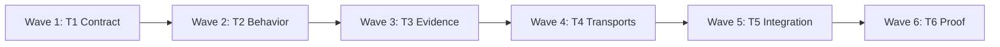

# Nerd Memory Sensitive Reuse Implementation Plan

## Focus Record

| Item | Details |
| --- | --- |
| Intention | Make Nerd Memory notice, retain, and retrieve more reusable patterns, verified workspace facts, and successful task approaches so later agents avoid unnecessary rediscovery. |
| Expectation | Plan |
| Scope | Plan changes across Nerd Memory's prompt contract, SQLite runtime, CLI/MCP surfaces, Smart/Explore/Execute integration, documentation, and tests. Do not implement the behavior. |
| Role | Memory-systems diagnostician and implementation planner |

## Summary

| Item | Details |
| --- | --- |
| Outcome | Strong direct-user patterns become reusable after one episode, ordinary direct choices become candidates after two independent episodes, and verified workspace facts/workflows become immediately searchable hints that shorten exploration without changing an endpoint or granting action authority. |
| Approach | Keep the existing seven-field behavioral lane and its proposal gate. Add a separate non-authoritative reusable-evidence lane for `workspace_fact` and `workflow_trace`, plus a concrete capture radar and deterministic hint matcher. Revalidate every hint before reliance and invalidate stale hints. |
| Root cause | Current behavior is structurally conservative: repository/tool findings and successful execution are inert, ordinary patterns default to three independent episodes, candidates need promotion, and recall accepts only confirmed patterns with exact scope and literal triggers. A successful prior task therefore usually creates no reusable record. |
| Proof | Red/green engine, migration, CLI, MCP, installer, skill-contract, and adversarial tests; then the full unittest suite, skill validator, Python compilation, and diff hygiene. |
| Deferred | Embeddings, remote or cross-namespace hint search, raw transcript storage, learned executable code, autonomous command execution, permissions, credentials, and changes to proposal confirmation or ordinary action authorization. |

## Selected Direction

| Direction | Decision |
| --- | --- |
| Prompt-only capture radar | Rejected as insufficient because the runtime intentionally cannot retain verified repository facts or successful-work evidence as active behavioral patterns. |
| Lower all existing gates | Rejected because it would conflate user preferences with tool-derived facts and turn uncertain work history into endpoint guidance. |
| Two-lane memory | Selected: behavioral patterns remain authoritative only through the existing gates; verified facts and workflows are stored as untrusted, revalidated hints outside the endpoint schema. |

The decisive trade-off is one additional persisted record type and MCP operation in exchange for higher recall without weakening the existing Authority, Taint, and Capability properties.

## Constraints and Non-goals

| Type | Constraint |
| --- | --- |
| Preserve | `goal`, `task`, `action`, `result`, `boundary`, `verification`, and `routing` remain the only fields that may affect an endpoint. |
| Preserve | Current explicit guidance outranks all memory; a behavioral memory still needs exact proposal confirmation and normal action authority. |
| Preserve | One episode repeated or paraphrased many times counts once. Legacy observations retain their current three-episode semantics after migration. |
| Safety | `workspace_fact` and `workflow_trace` records are local, namespace-scoped, minimal structured data. They never enter `proposed_endpoint`, `memory_diff`, proposal bindings, confirmation, consumption, or routing. |
| Safety | A reusable-evidence record may contain repository-relative anchors and argument-array proof commands, but never raw transcripts, file contents, shell command strings, secrets, credentials, remote URLs with credentials, executable code, or permission grants. A remembered command is data and cannot be executed until independently rediscovered in current repository configuration and approved by ordinary tool rules. |
| Matching | Hint recall requires exact namespace and stored scope, then either an exact stable task key supplied in current context, an exact phrase tag, or at least two normalized tag matches. Return at most five ranked hints; below-threshold input returns no hints rather than a nearest match. |
| Freshness | Every returned hint carries anchors, verification evidence, provenance, and `revalidation_required=true`. The consuming route performs the smallest current read-only check before relying on it; a failed check invalidates the hint before ordinary exploration continues. |
| Migration | The current worktree already contains user-owned, partially implemented global-fallback changes with `SCHEMA_VERSION = 10` and overlapping recall/test edits. This plan layers on that work only after it is separately stabilized, then uses version 11. Do not overwrite, absorb, or repair that feature under this plan. |
| Interaction | Batch successful writes into one existing `Nerd-memory memorized:` receipt of at most 30 words; keep memory-free reads and valid hint reuse silent. |

## Execution Precondition

The pre-existing global-fallback implementation currently has one focused failure: `MemoryContractTests.test_operational_guidance_stays_progressively_disclosed_and_compact` reports `recall-and-apply.md` at 905 words against its 800-word limit. Before this plan enters an Execute endpoint, that work must be completed under its own authority or isolated from the execution branch. The sensitivity work starts from a green focused Memory baseline and `SCHEMA_VERSION = 10`; it must not hide or fix that failure incidentally.

## Capture Sensitivity Matrix

| Signal | Lane | Required support | Result |
| --- | --- | --- | --- |
| Direct user explicitly says remember, always, default, prefer, from now on, or equivalent durable wording | Behavioral | 1 independent episode | Create the exact candidate and promote it under the current accepted activation event; later use still requires a Memory Proposal. |
| Direct user correction that supplies the durable replacement | Behavioral | 1 independent episode | Contest the old pattern immediately, create/promote the replacement, and invalidate dependent proposals/grants. |
| Same ordinary direct-user choice in separate root tasks | Behavioral | 2 independent episodes | Create/promote a candidate only for the identical typed value, scope, triggers, operation, and key. |
| Explicitly approved Focus/plan completes with relevant verification | Reusable evidence | 1 verified episode | Record a `workflow_trace`; do not infer that the workflow is a user preference. |
| Stable path, symbol, repository convention, or proof command is directly verified during in-boundary work | Reusable evidence | 1 verified episode | Record a `workspace_fact` with anchors and a revalidation recipe. |
| Tool/repository/assistant result without current verification, execution success without a reusable structure, silence, quoted text, or external content | Neither | N/A | Do not store, or keep existing inert telemetry only. |
| Secret, credential, permission, executable payload, volatile ID, or cross-namespace material | Neither | N/A | Reject. |

## Task Dependency Graph (TDG)

| Task | Wave | Depends on | Produces |
| --- | --- | --- | --- |
| T1 | 1 | None | Failing executable contract for sensitivity and lane isolation |
| T2 | 2 | T1 | Signal-aware behavioral consolidation and v11 migration |
| T3 | 3 | T2 | Reusable-evidence persistence, matching, revalidation, and invalidation |
| T4 | 4 | T3 | CLI/MCP/install parity for five memory tools |
| T5 | 5 | T4 | Smart/Explore/Execute capture radar and operator documentation |
| T6 | 6 | T5 | Integrated regression proof and delivery handoff |



Keep execution sequential. T2-T5 share the schema, recall response, skill-contract fixtures, and the same files touched by the separate global-fallback plan; parallel worktrees would increase merge and contract drift risk.

## Ordered Work

### Task 1: Lock the high-sensitivity contract with failing tests

**Focus:** Express the new green cases and prove that reusable evidence cannot become behavioral authority before changing runtime code.

**Files:**

| Action | Path |
| --- | --- |
| Create | `tests/test_memory_reuse.py` |
| Modify | `tests/test_memory_engine.py` |
| Modify | `tests/test_memory_security.py` |
| Modify | `tests/test_memory_mcp.py` |
| Modify | `tests/test_skill_contracts.py` |
| Modify | `tests/test_install_mcp.py` |

**Interfaces:**

| Direction | Contract |
| --- | --- |
| Produces | Behavioral signal fixtures for `durable_directive`, `user_correction`, `ordinary_choice`, and migrated `legacy`. |
| Produces | Reusable-evidence fixtures for `workspace_fact` and `workflow_trace`, including anchors, tags, verification, provenance, and stale invalidation. |
| Produces | Assertions that `MemoryStore.recall` returns `proposal` and `evidence_hints` as independent outputs. |

- [ ] Add a one-episode durable directive test: it creates one candidate, promotion requires the accepted activation event, and retrieval still stops at `pending_confirmation`.
- [ ] Add a two-episode ordinary-choice test and prove the same episode repeated 100 times still contributes one support root.
- [ ] Add a migration fixture proving existing observations become `legacy`, do not silently promote, and retain the three-episode threshold.
- [ ] Add reusable-evidence tests for one verified record, namespace/scope confinement, exact-key and two-tag matching, maximum-five ranking, unrelated no-match, stale invalidation, and reopen persistence.
- [ ] Add adversarial tests proving hints never appear in endpoint fields/diffs/bindings, cannot be confirmed or consumed, cannot bypass current guidance, and reject secrets, absolute/escaping paths, raw shell strings, unverified external content, and permission-bearing values.
- [ ] Add skill-contract tests for the capture matrix, revalidation-before-reliance rule, and behavior/evidence separation.
- [ ] Add MCP/install expectations for a fifth tool named `memory_experience` while preserving the existing four names.

Run:

```bash
rtk python3 -m unittest tests.test_memory_reuse tests.test_memory_engine tests.test_memory_security tests.test_memory_mcp tests.test_skill_contracts tests.test_install_mcp -v
```

Expected: FAIL only for the missing signals, schema, experience APIs, fifth MCP tool, and guidance.

### Task 2: Make behavioral consolidation signal-aware

**Focus:** Increase behavioral sensitivity only where direct-user evidence is strong, without reclassifying old data or weakening the proposal gate.

**Files:**

| Action | Path |
| --- | --- |
| Modify | `skills/nerd-memory/scripts/memory.py:68` (source/signal constants) |
| Modify | `skills/nerd-memory/scripts/memory.py:576` (`MemoryStore._initialise_schema`) |
| Modify | `skills/nerd-memory/scripts/memory.py:1331` (`MemoryStore.learn`) |
| Modify | `skills/nerd-memory/scripts/memory.py:1362` (`MemoryStore.observe`) |
| Modify | `skills/nerd-memory/scripts/memory.py:1719` (`MemoryStore.consolidate`) |
| Test | `tests/test_memory_engine.py` |
| Test | `tests/test_memory_security.py` |

**Interfaces:**

| Direction | Contract |
| --- | --- |
| Consumes | Optional behavior `signal`; omission remains `legacy` for compatibility. |
| Produces | Runtime-owned effective support thresholds: durable directive/correction = 1, ordinary choice = 2, legacy = 3. |
| Produces | Candidate results exposing `activation_reason`, signal mix, effective threshold, and distinct support episode IDs. |

- [ ] After the global-fallback baseline is green at version 10, increment `SCHEMA_VERSION` to 11 and add `observations.signal TEXT NOT NULL DEFAULT 'legacy'` inside the existing exclusive migration transaction.
- [ ] Add an immutable signal/source compatibility map. Only direct-user evidence may claim `durable_directive` or `ordinary_choice`; `user_correction` maps to the existing correction source and one-support replacement behavior; inert telemetry cannot select a behavioral signal.
- [ ] Change `learn`/`consolidate` so runtime policy owns the minimum threshold. Retain the current `min_episodes` argument only as an optional stricter floor; reject any caller value that attempts to lower the policy threshold.
- [ ] Carry signal metadata inside each existing fingerprint group without adding it to the fingerprint, so identical behavior can accumulate across eligible signals. Count independent root episodes exactly once and expose why a candidate was formed.
- [ ] Preserve existing candidate/confirmed states and revisions during migration; only unconsolidated legacy observations keep the three-episode rule.
- [ ] Keep promotion unchanged as a distinct, invocation-authorized write. Teach the caller later in T5 to promote only a candidate containing the current eligible event; never bulk-promote unrelated candidates.
- [ ] Preserve correction contesting, proposal/grant invalidation, forgotten fingerprints, exact scope/trigger grouping, and all seven pattern types.

Run:

```bash
rtk python3 -m unittest tests.test_memory_engine tests.test_memory_security tests.test_memory_denial -v
```

Expected: PASS for new thresholds and every existing lifecycle, replay, conflict, denial, split, and forget invariant.

### Task 3: Add the non-authoritative reusable-evidence lane

**Focus:** Persist and retrieve verified facts/workflows as read-only navigation hints that must be revalidated and can never influence an endpoint.

**Files:**

| Action | Path |
| --- | --- |
| Modify | `skills/nerd-memory/scripts/memory.py:576` (`MemoryStore._initialise_schema`) |
| Modify | `skills/nerd-memory/scripts/memory.py:1249` (`MemoryStore.recall`) |
| Modify | `skills/nerd-memory/scripts/memory.py:2400` (`MemoryStore.propose`, isolation assertion only) |
| Modify | `skills/nerd-memory/scripts/memory.py:4422` (CLI parser) |
| Modify | `skills/nerd-memory/scripts/memory.py:4676` (CLI dispatch) |
| Test | `tests/test_memory_reuse.py` |
| Test | `tests/test_memory_security.py` |

**Interfaces:**

| Direction | Contract |
| --- | --- |
| Produces | `MemoryStore.record_experience(...)`, `.find_experience(...)`, `.invalidate_experience(...)`, and `.list_experience(...)`. |
| Produces | `experience_hints` plus `experience_evidence` tables included in schema-version write fences. |
| Produces | `recall(...)["evidence_hints"]`, separate from the unchanged proposal payload. |
| Produces | CLI commands `record-experience`, `invalidate-experience`, and `list-experience`. |

- [ ] Create `experience_hints` with stable fingerprint, namespace, kind, key, minimal value, exact scope, normalized tags, repository-relative anchors, status, revision, support count, and first/last verification timestamps. Create `experience_evidence` keyed by hint and independent episode with source, evidence reference, verification shape, and timestamp.
- [ ] Accept only `workspace_fact` and `workflow_trace`. Require `source=direct_user` or `verified_execution`; the latter requires a successful current verification record. Reuse existing JSON normalization, size limits, sensitive-data rejection, private-store permissions, and consent checks. Evidence references may repeat within one approved capture bundle; only authority-changing transitions keep the global one-use event tombstone.
- [ ] Validate anchors as normalized paths relative to the current workspace with optional stable symbol names. Store proof commands only as argument arrays plus a relative working directory; reject shell strings and never execute them inside Memory.
- [ ] Deduplicate identical records by fingerprint while counting each root episode once. A verified replacement for the same kind/key/overlapping scope marks the older record stale; `invalidate_experience` also supports a current failed revalidation without a replacement.
- [ ] Implement deterministic matching: exact namespace and `_scope_matches` first; then exact current `task_key`, one exact phrase tag, or at least two normalized tag hits. Rank by scope specificity, tag score, support roots, and most recent verification; return at most five and never force a nearest match.
- [ ] Return each hint with bounded evidence, matched terms, anchors, verification recipe, `authority="untrusted_reusable_evidence"`, and `revalidation_required=true`.
- [ ] Keep `propose` querying only `patterns.status='confirmed'`. Add an explicit regression assertion that no experience table or returned hint participates in `proposed_endpoint`, `memory_diff`, `pattern_bindings`, proposal hashing, confirmation, or consumption.

Run:

```bash
rtk python3 -m unittest tests.test_memory_reuse tests.test_memory_security tests.test_memory_engine -v
```

Expected: PASS, including relevant reuse, safe empty results, stale invalidation, migration rollback, and behavior/evidence isolation.

### Task 4: Expose reusable evidence through MCP and installation

**Focus:** Keep CLI and MCP behavior equivalent and make live transport discovery require the complete upgraded tool surface.

**Files:**

| Action | Path |
| --- | --- |
| Modify | `skills/nerd-memory/scripts/mcp_server.py:34` (`TOOLS`) |
| Modify | `skills/nerd-memory/scripts/mcp_server.py:230` (`Server._dispatch`) |
| Modify | `scripts/install_mcp.py:31` (`nerd-memory-tools.expected_tools`) |
| Test | `tests/test_memory_mcp.py` |
| Test | `tests/test_install_mcp.py` |

**Interfaces:**

| Direction | Contract |
| --- | --- |
| Consumes | `memory_experience` requests with exact `action=record|invalidate`, with action-specific schemas and no extra fields. |
| Produces | Five live tools: `memory_recall`, `memory_settle`, `memory_learn`, `memory_inspect`, and `memory_experience`. |
| Produces | `memory_recall` and `memory_inspect` results including bounded `evidence_hints`; existing proposal/pattern keys remain compatible. |

- [ ] Add `memory_experience` rather than overloading the behavioral `memory_learn` schema. Its `record` form mirrors `record_experience`; its `invalidate` form accepts only hint ID, reason, source, and evidence reference.
- [ ] Extend `memory_recall` to return hints from the same warm `MemoryStore` without adding confirmation or consumption behavior. Extend `memory_inspect` with experience state for the supplied namespace only.
- [ ] Update current-registry preflight and installer expectations from four to five tools. A registered four-tool older server is `restart-required`, not silently accepted.
- [ ] Preserve structured/text payload equality, error mapping, sticky schema-restart handling, CLI fallback rules, and the rule that no tool combines proposal construction with confirmation.

Run:

```bash
rtk python3 -m unittest tests.test_memory_mcp tests.test_install_mcp tests.test_memory_engine.CompositeCommandLineTests -v
```

Expected: PASS with five tools, exact action validation, namespace confinement, restart handling, and CLI/MCP parity.

### Task 5: Teach the skill family when to capture and how to reuse

**Focus:** Make awareness deterministic at the prompt layer so the higher-sensitivity runtime is actually used.

**Files:**

| Action | Path |
| --- | --- |
| Modify | `skills/nerd-memory/SKILL.md` |
| Create | `skills/nerd-memory/references/recognize-and-reuse.md` |
| Modify | `skills/nerd-memory/references/learn-and-correct.md` |
| Modify | `skills/nerd-memory/references/recall-and-apply.md` |
| Modify | `skills/nerd-memory/references/memory-contract.md` |
| Modify | `skills/nerd-memory/references/research.md` |
| Modify | `skills/nerd-memory/references/transport-preflight.md` |
| Modify | `skills/nerd-smart/SKILL.md:104` (Memory composition) |
| Modify | `skills/nerd-explore/SKILL.md` (first-read discipline) |
| Modify | `skills/nerd-execute/SKILL.md:63` (approved behavior capture) |
| Modify | `scripts/validate_skills.py:125` (required Memory references) |
| Modify | `tests/test_skill_structure.py:149` (required Memory references) |
| Modify | `tests/test_skill_contracts.py:1501` (`MemoryContractTests`) |
| Modify | `README.md:41` and `README.md:49` |

**Interfaces:**

| Direction | Contract |
| --- | --- |
| Produces | A per-activation Memory Radar that checks recall before repeated discovery and checks capture after verified work. |
| Produces | Exact host rules for candidate promotion, hint revalidation, stale feedback, and one compact write receipt. |
| Produces | Progressive disclosure through `recognize-and-reuse.md`; the main skill remains within its compactness budget. |

- [ ] In `SKILL.md`, keep the memory-blind Focus/endpoint first, then require the radar on every accepted Memory activation: recall when the request references prior work or would otherwise need repository discovery; capture after a direct durable signal, correction, or verified reusable outcome.
- [ ] In `recognize-and-reuse.md`, encode the Capture Sensitivity Matrix above with concrete green, yellow, and red examples. Require stable pattern keys, minimal values, exact scope, independent root episodes, and no durability inference from mere success.
- [ ] Teach Smart to auto-enable Memory when prior-work language appears (`again`, `same`, `as before`, `previous`) or when a confirmed route has missing how/location/verification details that reusable evidence could supply. Do not use memory to resolve the Focus Record itself.
- [ ] Teach Explore to inspect at most five returned hints before its first repository search. For each hint, revalidate its exact anchors; on success, jump directly to the confirmed path/symbol, and on failure invalidate it and resume the ordinary smallest-read loop. Never execute a remembered command solely because it was recalled.
- [ ] Teach Execute to record one compact `workflow_trace` after approved, in-boundary work passes relevant proof and to record only genuinely reusable `workspace_fact` anchors. Direct durable guidance and corrections use behavioral learning; incidental implementation details do not.
- [ ] Clarify that a successful task is evidence that a workflow worked once, not proof of user preference. Behavioral proposals keep their exact gate; evidence hints remain silent, untrusted, and read-only until revalidated.
- [ ] Update the runtime contract with v11 tables, signal thresholds, experience lifecycle, matching/ranking, MCP/CLI forms, migration/fencing, and required evaluation. Update the research basis to describe the two-lane application of existing episodic/procedural memory sources; add no dependency or unsupported claim.
- [ ] Register the new reference in both validators and update README language from seven behavioral fields only to behavioral patterns plus verified reusable evidence.

Run:

```bash
rtk python3 -m unittest tests.test_skill_contracts tests.test_skill_structure -v
rtk python3 scripts/validate_skills.py
```

Expected: PASS; the main Memory skill remains compact, all references are reachable, all five tools are named, and every route preserves the behavior/evidence boundary.

### Task 6: Run integrated proof and inspect the final diff

**Focus:** Prove the sensitivity gain and every preserved safety invariant against the complete repository.

**Files:**

| Action | Path |
| --- | --- |
| Verify | All files modified by T1-T5 |
| Preserve | `docs/plans/2026-08-21-nerd-memory-explicit-global-fallback.md` and unrelated user changes |

- [ ] Run the focused Memory suites, including migration, denial/split/forget, transport, install, and prompt contracts.
- [ ] Run the complete repository suite and skill validator.
- [ ] Compile changed Python entry points and check diff whitespace.
- [ ] Inspect the final diff for accidental cross-namespace search, an eighth endpoint field, raw transcript/file storage, automatic command execution, confirmation bypass, transport-preflight regression, or edits to the separate global-fallback plan.
- [ ] Exercise one end-to-end temporary-database scenario: verified Execute records a workflow hint; a paraphrased later task recalls it; Explore revalidates its anchor; the endpoint remains memory-free unless a separate confirmed behavioral pattern applies.

Run:

```bash
rtk python3 -m unittest tests.test_memory_engine tests.test_memory_reuse tests.test_memory_mcp tests.test_memory_security tests.test_memory_denial tests.test_skill_contracts tests.test_skill_structure tests.test_install_mcp -v
rtk python3 -m unittest discover -s tests -v
rtk python3 scripts/validate_skills.py
rtk python3 -m py_compile skills/nerd-memory/scripts/memory.py skills/nerd-memory/scripts/mcp_server.py skills/nerd-smart/scripts/prompt_hook.py
rtk git diff --check
rtk git status --short
```

Expected: all tests and validation pass; compilation exits 0; `git diff --check` emits no output; only approved implementation files plus pre-existing user files are changed.

## Self Review

| Checkpoint | Nerd Review lens | Evidence | Status |
| --- | --- | --- | --- |
| Executability | Level 1 — concrete defects | Every task names existing files and symbols, new interfaces, red/green commands, expected results, and a stopping condition. Current line anchors were checked against the modified `memory.py`, `mcp_server.py`, Smart, Explore, Execute, validators, and focused tests; the unrelated failing baseline is isolated by an explicit precondition. | Pass |
| Repository fit | Level 2 — consistency and proof | The plan preserves stdlib SQLite, private local storage, engine/CLI/MCP parity, current unittest conventions, skill compactness checks, `validate_skills.py`, and the existing confirmation/denial/forget lifecycle. | Pass |
| Architecture | Level 3 — harmful complexity | Reusable evidence uses one separate lane and one MCP operation rather than becoming an eighth endpoint field or weakening behavioral provenance. Deterministic matching avoids an embedding dependency and permits a safe empty result. | Pass |
| Scope integrity | Adversarial evidence check | Every task supports increased capture or reuse, its transport/integration, or required proof. Cross-namespace search, autonomous execution, and unrelated memory redesign remain excluded. | Pass |

- **Findings:** The user-owned global-fallback implementation is already present, conflicts on recall/migration surfaces, and currently has one skill-compactness failure (`recall-and-apply.md`: 905 words, limit 800). The execution precondition prevents this plan from obscuring or repairing that failure without separate authority.
- **Unknowns:** Whether the global-fallback work will be completed or isolated. This blocks execution, not the plan artifact.

## Final Validation

| Check | Command | Expected |
| --- | --- | --- |
| Focused behavior and safety | `rtk python3 -m unittest tests.test_memory_engine tests.test_memory_reuse tests.test_memory_mcp tests.test_memory_security tests.test_memory_denial tests.test_skill_contracts tests.test_skill_structure tests.test_install_mcp -v` | PASS |
| Full regression | `rtk python3 -m unittest discover -s tests -v` | PASS |
| Skill quality | `rtk python3 scripts/validate_skills.py` | Exit 0 |
| Python syntax | `rtk python3 -m py_compile skills/nerd-memory/scripts/memory.py skills/nerd-memory/scripts/mcp_server.py skills/nerd-smart/scripts/prompt_hook.py` | Exit 0 |
| Diff hygiene | `rtk git diff --check` | No output |

## Acceptance Criteria

| ID | Criterion | Evidence |
| --- | --- | --- |
| AC1 | One explicit durable directive or durable correction can become a confirmed behavioral pattern in one activated request, but later application still requires an exact Memory Proposal confirmation. | Engine lifecycle and security tests. |
| AC2 | Two matching ordinary choices from independent root episodes can form a pattern; repeated messages in one episode cannot, and migrated legacy records retain the prior three-episode rule. | Consolidation and migration tests. |
| AC3 | One verified completed task can store a reusable workflow or workspace fact without representing it as user preference. | Reusable-evidence record/reopen tests. |
| AC4 | A related later request retrieves at most five exact-scope hints through stable key, phrase, or two-tag matching; unrelated input safely returns none. | Matching and ranking tests. |
| AC5 | Explore revalidates every hint before reliance, invalidates stale hints, and resumes narrow repository discovery when validation fails. | Skill-contract fixture plus end-to-end temporary-database scenario. |
| AC6 | Reusable evidence never changes endpoint fields, proposals, diffs, bindings, confirmation, consumption, routing, permissions, or command authority. | Adversarial security tests. |
| AC7 | Secrets, raw transcripts/files, unverified external material, escaping/absolute paths, shell strings, executable code, volatile identifiers, and permission grants remain rejected or inert. | Input validation and poisoning fixtures. |
| AC8 | MCP and CLI expose equivalent record, recall, inspect, and invalidate behavior; preflight and installer require exactly the upgraded five-tool surface. | MCP, CLI, install, and transport-contract tests. |
| AC9 | Version-10 stores migrate atomically to v11, stale writers remain fenced, and every current confirmation, replay, conflict, denial, split, forget, namespace, current-guidance, and explicit-global-fallback invariant still passes. | Migration, security, denial, and full-regression suites. |

Implementation requires a new Nerd Smart Focus Record resolved to the **Execute** endpoint. This plan does not authorize execution.
